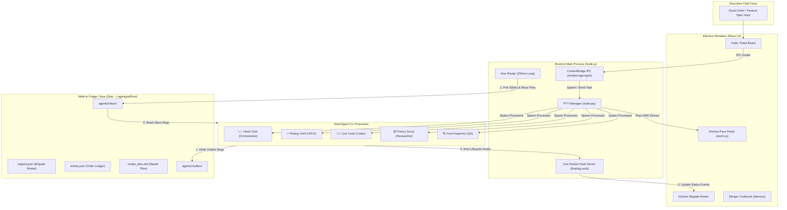

<div align="center">

# 👨‍🍳 AgentGrid Kitchen

### Autonomous Multi-Agent Desktop Suite — The Michelin Kitchen Architecture

[](LICENSE)
[](tests/run-phase1-tests.ts)
[](v1_arch.md)

</div>

---

## 🍳 Overview
**AgentGrid Kitchen** is a high-performance **Desktop Application** built on Electron, React 18, TypeScript, `node-pty`, and Unix Domain Sockets. 

Modeled after a **Michelin-Star Kitchen Brigade**, 1 human **Executive Chef (Operator)** coordinates 5 specialized **Station Chef Agents** who collaborate asynchronously through an on-disk filesystem post office called **The Walk-in Fridge (The Hive)**.

---

## 👨‍🍳 The Kitchen Brigade (1 Operator + 5 Station Chefs)

```
                       ┌─────────────────────────────────────┐
                       │  YOU (Executive Chef / Operator)    │
                       │  - Inputs guest orders & menu specs │
                       └──────────────────┬──────────────────┘
                                          │
                       ┌──────────────────▼──────────────────┐
                       │      Head Chef (Orchestrator)       │
                       │      - Drafts recipe_plan.md        │
                       │      - Dispatches tickets to cooks  │
                       └─┬─────────────┬─────────────┬───────┘
                         │             │             │
        ┌────────────────┴┐           ─┼─           ┌┴────────────────┐
        ▼                 ▼            ▼            ▼                 ▼
  🎨 Plating Chef   💻 Line Cook  📦 Pantry Scout  🔍 Food Inspector
   (UI/UX & CSS)    (Full-Stack)   (Docs & APIs)    (QA & Bug Tests)
```

| Role | Kitchen Title | Responsibilities |
| :--- | :--- | :--- |
| **Operator (You)** | **Executive Chef** | Inputs guest orders and defines high-level feature requirements. |
| **Agent 1** | **👨‍🍳 Head Chef** *(Orchestrator)* | Reads guest orders, drafts master prep plan (`recipe_plan.md`), delegates tickets. |
| **Agent 2** | **🎨 Plating Chef** *(UI/UX Designer)* | Focuses on visual presentation, UI component layouts, theme aesthetics, & Tailwind styles. |
| **Agent 3** | **👨‍🍳 Line Cook** *(Full-Stack Coder)* | Prepares raw code logic, implements backend & frontend routes, runs shell build commands. |
| **Agent 4** | **📦 Pantry Scout** *(Researcher)* | Scrapes documentation, searches web/APIs, and fetches fresh library specs. |
| **Agent 5** | **🔍 Food Inspector** *(QA / Reviewer)* | Tastes dishes (audits code), runs unit tests, and verifies quality before service. |

---

## 🏛️ System Architecture

AgentGrid Kitchen operates on **Two Data Planes**:

1. **Terminal Plane (`node-pty` + `xterm.js`):** Spawns true operating system pseudo-terminals for CLI agent processes (e.g. Claude Code CLI, Bash, Git) and streams raw ANSI terminal output to React UI tabs.
2. **Event Plane (Unix Socket Server):** Captures real-time lifecycle hooks (`PreToolUse`, `Stop`) over `/tmp/ag.sock` to update UI station status lights (🟢 Working, 🟡 Idle, 🔴 Blocked) in sub-milliseconds.



---

## 🔒 The Single-Writer Rule & Hive Router
* **Single-Writer Security:** Station Chefs can **only** write to files inside their own `outbox/` directory (`~/.agentgrid/hive/agents/<chef>/outbox/`). Direct cross-directory writes are automatically discarded.
* **Hive Router Loop:** A 200ms background interval in the main process scans `outbox/` folders and atomically moves message files (`fs.renameSync`) to the recipient's `inbox/`.

---

## 📂 Clean Architecture Directory Layout

```
AgentGrid-Kitchen/
├── v1_arch.md                ← Master Architecture Specification
├── README.md                 ← Project Documentation
├── package.json              ← Root dependencies and scripts
├── tsconfig.json             ← TypeScript configuration
├── vitest.config.ts          ← Test runner configuration
│
├── src/
│   ├── domain/               ← 🎯 CORE DOMAIN (Pure Types & Constants)
│   │   ├── types/
│   │   │   └── hive.types.ts ← HiveMessage, OrderTicket, BrigadeRegistry
│   │   └── constants/
│   │       └── paths.constants.ts
│   │
│   ├── application/          ← 🧩 USE CASES & BUSINESS LOGIC
│   │   ├── initializer/
│   │   │   └── HiveInitializer.ts
│   │   └── router/
│   │       └── HiveRouter.ts ← 200ms Single-Writer Router Engine
│   │
│   └── infrastructure/       ← 🔌 DRIVERS & OS ADAPTERS (Phase 2 & 3)
│
└── tests/                    ← 🧪 UNIFIED TEST SUITE
    ├── run-phase1-tests.ts   ← Native Phase 1 Test Runner
    └── unit/
        ├── initializer.test.ts
        └── router.test.ts
```

---

## 🚀 Getting Started

### Prerequisites
* Node.js **>= 18.0.0** (Node 24+ recommended)

### Run Unit & Security Tests
To execute the automated Phase 1 test suite natively:

```bash
node --experimental-strip-types --test tests/run-phase1-tests.ts
```

Output:
```bash
▶ Phase 1: Hive Storage & File Router Engine
  ✔ should initialize walk-in fridge directory structure and default files (16.5ms)
  ✔ should move valid messages from sender outbox to recipient inbox (7.1ms)
  ✔ should discard messages violating Single-Writer rule (4.1ms)
✔ Phase 1: Hive Storage & File Router Engine (28.4ms)

ℹ tests 3 | pass 3 | fail 0
```

---

## 🗺️ Build Roadmap

- [x] **Phase 1:** Hive Storage Engine & 200ms Single-Writer Router *(Complete ✅)*
- [ ] **Phase 2:** Unix Socket Hook Server (`/tmp/ag.sock`)
- [ ] **Phase 3:** `node-pty` Agent Process Spawner & ANSI Stream Buffer
- [ ] **Phase 4:** Electron Main Window & ContextBridge Security Bridge
- [ ] **Phase 5:** React UI (Kitchen Pass, Order Ticket Board, Station Roster)
- [ ] **Phase 6:** Station Chef System Prompts & Full E2E Workflow

---

## 📄 License
[MIT](LICENSE) © 2026 AgentGrid Kitchen Team.
