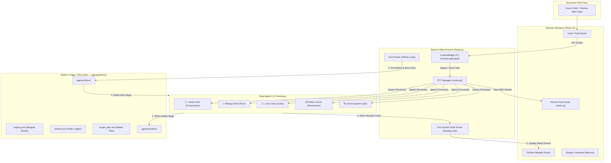

# AgentGrid V1 — Complete Architecture Specification (The Michelin Kitchen)

---

## 📌 Executive Summary
**AgentGrid V1** is a production-grade **Desktop Application** built with **Electron, React 18, TypeScript, node-pty, and Unix Sockets**. It features a **Restaurant Kitchen Brigade Theme** where 1 human **Executive Chef (Operator)** coordinates 5 autonomous **Station Chef Agents** via an asynchronous, on-disk post office mechanism called **The Hive**.

---

## 💡 Why a Desktop Application?
Unlike web apps sandboxed inside browser tabs, AgentGrid V1 requires native OS capabilities:
1. **Real PTY Execution (`node-pty`):** Spawns true operating system pseudo-terminals for CLI agent processes (e.g. Claude Code CLI, Bash, Git).
2. **Local File System IPC (`fs` + `chokidar`):** Low-latency, asynchronous file reading/writing/watching in `~/.agentgrid/hive/`.
3. **Unix Socket Event Server (`net`):** Listens on `/tmp/ag.sock` for real-time agent lifecycle hooks (`PreToolUse`, `Stop`).

---

## 🧠 Core Concepts

### 1. Two Data Planes
* **Terminal Plane (`node-pty` + `xterm.js`):** Streams raw terminal bytes (ANSI colors, cursor control) from actual CLI agent processes into React UI tabs.
* **Event Plane (Unix Socket Server):** Captures real-time lifecycle hooks (`PreToolUse`, `Stop`) over `/tmp/ag.sock` to update UI status indicators (🟢 Working, 🟡 Idle, 🔴 Blocked) instantly.

### 2. The Hive (On-Disk Post Office)
* Agents communicate asynchronously by writing `.json` message files inside `~/.agentgrid/hive/agents/<chef>/outbox/`.

### 3. Single-Writer Rule & 200ms Router Loop
* **Rule:** No agent ever writes to another agent's folder or shared global files directly.
* **Router:** A central loop running every 200ms in the main process scans `outbox/` folders and atomically moves message files (`fs.renameSync`) to the recipient's `inbox/`.

### 4. Unix Socket Hook Server
* A Node `net` server listening on `/tmp/ag.sock`. When an agent uses a tool or finishes reasoning, it emits a JSON payload to this socket, updating the UI state immediately.

### 5. Electron ContextBridge
* A typed security layer (`window.agentgrid`) in `preload/index.ts` connecting the React UI to main process capabilities without exposing raw Node.js modules to the DOM.

---

## 👨‍🍳 The Kitchen Brigade (1 Operator + 5 Station Chefs)

```
                       ┌─────────────────────────────────────┐
                       │  YOU (Executive Chef / Operator)    │
                       │  - Sets menu goals & order specs    │
                       └──────────────────┬──────────────────┘
                                          │
                       ┌──────────────────▼──────────────────┐
                       │      Head Chef (Orchestrator)       │
                       │      - Drafts recipe_plan.md        │
                       │      - Dispatches tickets to cooks  │
                       └─┬─────────────┬─────────────┬───────┘
                         │             │             │
        ┌────────────────┴┐           ─┼─           ┌┴────────────────┐
        ▼                 ▼            ▼            ▼                 ▼
  🎨 Plating Chef   💻 Line Cook  📦 Pantry Scout  🔍 Food Inspector
   (UI/UX & CSS)    (Full-Stack)   (Docs & APIs)    (QA & Bug Tests)
```

| Role | Kitchen Title | Responsibilities |
| :--- | :--- | :--- |
| **Operator (You)** | **Executive Chef** | Inputs guest orders and defines high-level feature requirements. |
| **Agent 1** | **👨‍🍳 Head Chef** *(Orchestrator)* | Reads guest orders, drafts master prep plan (`recipe_plan.md`), delegates tickets. |
| **Agent 2** | **🎨 Plating Chef** *(UI/UX Designer)* | Focuses on visual presentation, UI component layouts, theme aesthetics, & Tailwind styles. |
| **Agent 3** | **👨‍🍳 Line Cook** *(Full-Stack Coder)* | Prepares raw code logic, implements backend & frontend routes, runs shell build commands. |
| **Agent 4** | **📦 Pantry Scout** *(Researcher)* | Scrapes documentation, searches web/APIs, and fetches fresh library specs. |
| **Agent 5** | **🔍 Food Inspector** *(QA / Reviewer)* | Tastes dishes (audits code), runs unit tests, and verifies quality before service. |

---

## 📊 Architecture Diagram



---

## 📂 Hive Storage & Message Schemas

### Directory Structure (`~/.agentgrid/hive/`)
```
hive/
  registry.json          ← brigade roster & status
  tickets.json           ← master order ticket ledger
  log.jsonl              ← append-only event feed
  recipe_plan.md         ← master plan (written ONLY by Head Chef)
  agents/
    headchef/
      identity.md        ← agent role & system prompt
      memory.md          ← long-term memory across sessions
      inbox/             ← received message files
      outbox/            ← outgoing message files
    plating/             ← same structure
    linecook/            ← same structure
    pantry/              ← same structure
    inspector/           ← same structure
```

### Outbox Message Schema (`msg-001.json`)
```json
{
  "id": "msg-101",
  "from": "linecook",
  "to": "headchef",
  "act": "done",
  "subject": "Auth API route implementation complete",
  "body": "Created POST /api/auth/login and POST /api/auth/register with unit tests passing.",
  "timestamp": "2026-10-02T14:00:00Z"
}
```

---

## 🏗️ Production-Level 6-Phase Build Plan (TDD Approach)

### 🧪 Phase 1: Hive Engine & File Router (Core Storage & IPC)
* **What We Build:**
  * Hive directory initializer (`mkdir -p ~/.agentgrid/hive/agents/{headchef,plating,linecook,pantry,inspector}/{inbox,outbox}`).
  * `HiveRouter` class: 200ms `setInterval` loop scanning `outbox/` and atomically moving files (`fs.renameSync`) to `inbox/`.
  * Single-Writer rule enforcement.
* **Testing Strategy (Vitest):**
  * `hive-init.test.ts`: Verifies directory structure creation.
  * `router-delivery.test.ts`: Mocks an outbox file creation and asserts recipient inbox delivery within 250ms.
  * `single-writer.test.ts`: Asserts cross-directory direct writes are rejected.

---

### 🧪 Phase 2: Unix Socket Hook Server
* **What We Build:**
  * Node `net.createServer` listening on `/tmp/ag.sock`.
  * Stream buffer parser for lifecycle events (`PreToolUse`, `PostToolUse`, `Stop`, `Notification`).
  * Main process event emitter.
* **Testing Strategy (Vitest):**
  * `hook-server.test.ts`: Sends mock JSON payloads over client socket and verifies event emission.
  * `buffer-fragmentation.test.ts`: Verifies parser handles chunked / partial socket streams cleanly.

---

### 🧪 Phase 3: PTY Manager & Agent Spawning
* **What We Build:**
  * `PtyManager` module wrapping `node-pty`.
  * Environment variable injector (`HIVE_SOCK=/tmp/ag.sock`, `AGENT_ROLE=linecook`).
  * Process controls: `spawnAgent()`, `writeToAgent()`, `resizeAgent()`, `killAgent()`.
* **Testing Strategy (Vitest):**
  * `pty-spawn.test.ts`: Spawns mock shell PTY, sends command, verifies stdout data stream.
  * `pty-cleanup.test.ts`: Ensures clean process termination and exit code logging.

---

### 🧪 Phase 4: Electron Main Process & ContextBridge Security
* **What We Build:**
  * Electron main window setup (`src/main/index.ts`).
  * Safe preload bridge (`src/preload/index.ts`) exposing `window.agentgrid`.
  * IPC channel handlers (`ipcMain.handle`, `ipcRenderer.invoke`).
* **Testing Strategy (Playwright for Electron):**
  * `context-bridge.test.ts`: Verifies DOM cannot access raw Node APIs (`require`, `fs`, `child_process`).

---

### 🧪 Phase 5: React UI (Kitchen Pass, Ticket Board & Roster)
* **What We Build:**
  * **Kitchen Pass:** `@xterm/xterm` canvas terminal component for live chef streams.
  * **Order Ticket Board:** Kanban board for task tickets (`pending`, `in_progress`, `completed`).
  * **Kitchen Brigade Roster:** Status lights (🟢 Working, 🟡 Idle, 🔴 Blocked) linked to socket events.
  * **Zustand Store:** Reactive state store.
* **Testing Strategy (React Testing Library + Vitest):**
  * `ticket-board.test.tsx`: Asserts adding new ticket updates UI board.
  * `store.test.ts`: Unit tests state store mutations.

---

### 🧪 Phase 6: System Prompts & E2E Integration Workflow
* **What We Build:**
  * System prompts (`identity.md`) for all 5 station chefs.
  * Full E2E task execution pipeline.
* **Testing Strategy (Full E2E Simulation):**
  * `e2e-kitchen-workflow.test.ts`: Simulates full flow from guest order → Head Chef plan → Line Cook execution → Food Inspector QA approval → Task completed.

---

## 📦 Tech Stack Summary Table

| Category | Library / Technology | Purpose |
| :--- | :--- | :--- |
| **Desktop Shell** | Electron | Native window management and system integration. |
| **Frontend UI** | React 18 + TypeScript | Component UI for Kitchen Pass, Ticket Board, Roster. |
| **Terminal Render** | `@xterm/xterm` + `@xterm/addon-fit` | Canvas terminal output display. |
| **State Management** | Zustand | Fast reactive UI state. |
| **Styling** | Tailwind CSS + Lucide Icons | Michelin kitchen theme styling and icons. |
| **PTY Engine** | `node-pty` | Real operating system terminal spawning. |
| **Telemetry Socket** | `net` *(Node built-in)* | Local Unix socket (`/tmp/ag.sock`) event server. |
| **File Watcher** | `chokidar` + `fs` | Hive outbox watcher and message router. |
| **Database** | `better-sqlite3` | Local session history & cost tracking. |
| **Testing** | Vitest + Playwright | Unit, component, and E2E integration testing. |
